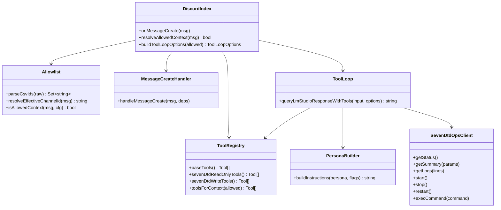
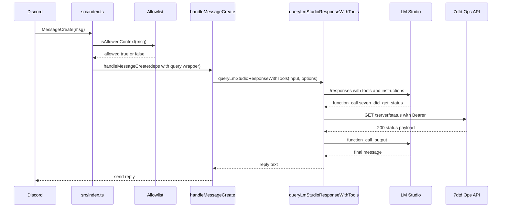

## 1. 概要と目的 Overview and Purpose

* What
  Discord ボットに 7 Days to Die サーバー管理ツール群を追加する。ただし許可された Guild と Channel のみでツール定義を LM に渡し、それ以外の場所では 7dtd 系ツールを一切 tool list に含めない。許可された場所では 7dtd 運用専用のペルソナを instructions に設定する。

* Why
  サーバー操作は破壊的になり得るため、誤操作と権限外利用のリスクを最小化する。加えて、tool list を限定することで許可外チャンネルへの能力露出を抑え、プロンプトインジェクション経路を狭める。

* How
  Discord メッセージ受信時に実行コンテキストを評価し、ToolSet と Persona を決定する。決定結果を `queryLmStudioResponseWithTools` の options として渡し、tool-loop 側で tools と instructions を動的に構築する。

---

## 2. 仕様と受け入れ条件 Specification and Acceptance Criteria

### 2.1 スコープ Scope

* 今回やること

  * 許可 Guild ID と許可 Channel ID の allowlist 判定を実装する
  * 許可されたコンテキストのみで 7dtd ツール定義を `tools` に追加する
  * 許可されたコンテキストのみで 7dtd 運用専用ペルソナを instructions に適用する
  * tool-loop が外部から tools と persona を注入できるように拡張する
  * `handleMessageCreate` から `queryLmStudioResponseWithTools(input, options)` を渡せるよう依存型と呼び出し契約を更新する
  * 既存ツール `current_time` `web_research_digest` `assistant_profile` と 7dtd ツールの共存ルールを定義する
  * 今回スコープの 7dtd は read-only（status summary logs）を優先し、破壊系は後続 Phase で扱う
  * 必要なユニットテストを追加する

* 成果物

  * allowlist 判定モジュール
  * 7dtd read-only tool 定義と実行クライアントの骨格
  * tool-loop の options 拡張
  * message-create-handler の deps 型およびテスト更新
  * テスト追加と既存テストの更新

* 制約

  * プロトタイプ優先であり、UI や権限管理の高度化は行わない
  * 7dtd API の実呼び出しは統合テストではなくモック中心とする

### 2.2 非スコープ Non Scope

* 許可ユーザー ID の allowlist やロールベース制御
* 破壊操作に対する二段階確認フロー
* 7dtd API の OpenAPI からの自動コード生成
* 7dtd 運用ログの永続化や監査機能

### 2.3 ユースケース Use Cases

* 正常系

  1. 許可チャンネルで「サーバー状態教えて」と聞くと、LM が 7dtd ツールを利用して結果を返す
  2. 許可チャンネルで「ログ 50 行」と聞くと、7dtd ログ取得ツールを利用して返す
  3. 許可チャンネル配下のスレッドで同様に 7dtd ツールが使える。判定は親チャンネル基準

* 異常系

  1. 非許可チャンネルで 7dtd 関連の依頼をしても、LM には 7dtd ツール定義が渡らない
  2. DM では 7dtd ツール定義は渡らない
  3. allowlist が未設定の場合、7dtd ツール定義はどこにも渡らない

### 2.4 受け入れ条件 Acceptance Criteria

* Given allowlist が未設定
  When 任意のチャンネルでメッセージを処理する
  Then LM リクエストの tools に 7dtd 系ツールが含まれない

* Given 許可 Guild と許可 Channel に一致するメッセージ
  When `queryLmStudioResponseWithTools` を呼ぶ
  Then tools に 7dtd 系ツールが追加され、instructions に 7dtd 運用専用ペルソナが含まれる

* Given `handleMessageCreate` から `queryLmStudioResponseWithTools` を呼ぶ
  When tool options を指定する
  Then `queryLmStudioResponseWithTools(input, options)` の呼び出し契約が型安全に維持される

* Given 非許可 Channel のメッセージ
  When `queryLmStudioResponseWithTools` を呼ぶ
  Then tools はベースツールのみで、instructions はデフォルトペルソナのままである

* Given 許可 Channel 配下のスレッドでのメッセージ
  When allowlist 判定を行う
  Then 親チャンネル ID を基準に許可判定される

* Given 許可コンテキストで 7dtd API がエラーを返す
  When 7dtd ツール実行を行う
  Then ツール出力は JSON で失敗を表現し、ボットは例外で落ちない

* Given 許可コンテキストで 7dtd ツールが有効
  When 同一入力が current_time や web_research_digest の強制条件にも一致する
  Then 既存強制ツール判定は維持し、7dtd ツールは追加候補として共存する

### 2.5 既知の制約 Known Limitations

* allowlist は Guild と Channel の静的リストのみで、Discord の権限体系とは連動しない
* 7dtd 専用ペルソナは許可チャンネル内では常に適用される。汎用雑談用途には向かない
* 7dtd ツール未実装の操作は、Unknown tool と同等のエラー応答になる
* 破壊系 7dtd ツール（start stop restart exec）は本計画の後半フェーズまで既定で無効にする

---

## 3. 前提技術スタック Context and Tech Stack

* Language Framework
  TypeScript、Node.js、discord.js

* Libraries
  既存の fetch を利用。追加で必要なら軽量なバリデーションのみ導入するが、基本は手書きパースで進める

* Style Guide
  既存の Linter Formatter とテストスタイルに従う

* Runtime Deployment
  既存の実行形態を維持する

* Testing
  Vitest。HTTP 呼び出しはモックする

---

## 4. インターフェース契約 Interface Contracts

### 4.1 公開APIまたは外部I O一覧

* Discord 入力
  MessageCreate イベントで受け取る `msg.guildId` `msg.channelId` `msg.channel.isThread()` `msg.channel.parentId`

* 設定ファイル
  `.env`

* 外部サービス連携
  7dtd Ops API
  `servers[0].url = https://stats7dtd.suzu.me.uk`
  Bearer 認証

### 4.2 データモデルとスキーマ

* allowlist 設定

  * `ALLOWED_GUILD_IDS`
    カンマ区切りの Guild ID 群。未設定または空なら 7dtd ツール無効
  * `ALLOWED_CHANNEL_IDS`
    カンマ区切りの Channel ID 群。未設定または空なら 7dtd ツール無効
  * 判定は AND 条件
    両方のリストに含まれる場合のみ許可

* 7dtd API 設定

  * `SEVEN_DTD_OPS_BASE_URL` 省略時は `https://stats7dtd.suzu.me.uk`
  * `SEVEN_DTD_OPS_TOKEN` 必須。未設定なら 7dtd ツールは実行時にエラーを返す

* tool-loop 拡張 options

  * `tools` 任意。未指定なら従来のベースツールセット
  * `persona` 任意。`default` と `seven_dtd_ops` を定義
  * `queryLmStudioResponseWithTools(input, options)` を `handleMessageCreate` deps 経由で受け渡し可能にする
  * 既存の強制ツール判定（current_time web_research_digest assistant_profile）は options 拡張後も維持する

* 7dtd ツール定義
  プロトタイプでは複数ツール方式で開始し、必要なら統合ツールに集約する。今回は read-only を先行する

  * `seven_dtd_get_status`
  * `seven_dtd_get_summary`
  * `seven_dtd_get_logs`
  * 破壊系は後続フェーズ（既定無効）
  * `seven_dtd_start`
  * `seven_dtd_stop`
  * `seven_dtd_restart`
  * `seven_dtd_exec_command`

### 4.3 エラーと例外 Error Handling

* エラー分類

  * allowlist 未許可
    7dtd ツールを tool list に入れない。実行自体が起きない設計
  * 設定不足
    `SEVEN_DTD_OPS_TOKEN` 未設定などはツール実行結果として `error` を JSON 返却
  * HTTP エラー
    ステータスと本文を短く要約して JSON 返却
  * タイムアウト
    AbortController で打ち切り、タイムアウトとして JSON 返却

* リトライ方針
  プロトタイプではリトライしない。失敗をそのまま返す

* タイムアウト方針
  `SEVEN_DTD_OPS_TIMEOUT_MS` を追加し、未設定なら 10 秒程度で固定

* ログ方針と個人情報の扱い
  bearer token はログに出さない。ログ本文は最大長を制限する

### 4.4 代表的な例 Examples

* .env 例

```env
ALLOWED_GUILD_IDS=123456789012345678
ALLOWED_CHANNEL_IDS=234567890123456789
SEVEN_DTD_OPS_BASE_URL=https://stats7dtd.suzu.me.uk
SEVEN_DTD_OPS_TOKEN=xxxxxxxxxxxxxxxx
SEVEN_DTD_OPS_TIMEOUT_MS=10000
```

* 7dtd ツール呼び出し例
  LM からの function_call 入力イメージ

```json
{"type":"function_call","name":"seven_dtd_get_logs","input":"{\"lines\":50}"}
```

```json
{"type":"function_call","name":"seven_dtd_get_logs","arguments":"{\"lines\":50}"}
```

* スレッド判定例
  スレッド投稿は `channel.parentId` を評価対象チャンネルとして扱う

---

## 5. アーキテクチャと設計図 Architecture and Diagrams

### 5.1 図の選択方針

* 外部 I O と責務分割が増えるためクラス図を作成する
* 主要な流れが重要なのでシーケンス図も追加する

### 5.2 クラス図 Class Diagram



### 5.3 シーケンス図 Optional



---

## 6. テスト戦略 Test Strategy

### 6.1 テストの種類

* Unit

  * Allowlist 判定
    Guild と Channel の一致、未設定時無効、スレッド親チャンネル判定
  * ToolRegistry
    allowed true でのみ 7dtd ツールが含まれる
  * ToolLoop options
    options.tools が LM リクエストに反映される
    persona が instructions に反映される
    message-create-handler deps 経由の query 呼び出し契約が崩れない

* Integration
  今回は行わない。HTTP はモックで十分

* Contract
  7dtd ツールの入出力 JSON 形式が崩れないことをテストで固定する

### 6.2 カバレッジ対象

* 重要ロジック
  allowlist 判定、親チャンネル解決、tools 注入、persona 注入

* エラー分岐
  token 未設定、HTTP 非 200、タイムアウト

* 境界条件
  allowlist 文字列の空白、末尾カンマ、スレッド parentId 不在

---

## 7. 実装タスクリスト Implementation Plan

### Phase 1 設計と準備

* [ ] 要件と仕様の確定 受け入れ条件の確定
  成果物: 本 plan をベースに TODO を確定

* [ ] インターフェース契約の確定 スキーマと例の追加
  対象: `.env.example` があれば更新。なければ README に追記

* [ ] Mermaid図の作成 更新
  対象: plan 内の図を必要に応じて更新

* [ ] インターフェース 型定義の作成
  対象ファイル案

  * `src/discord/tool-loop.ts` ToolLoopOptions 拡張
  * `src/discord/tool-loop-policy.ts` persona 対応
  * `src/discord/allowlist.ts` 新規

* [ ] テスト基盤の確認
  既存 Vitest のモック方針に合わせる

### Phase 2 Allowlist 判定の実装

* [ ] Test allowlist の未設定時は常に false Red
  対象: `tests/allowlist.test.ts` 新規

* [ ] Impl allowlist 判定を追加 Green
  対象: `src/discord/allowlist.ts` 新規

* [ ] Refactor 既存コードとの重複排除
  文字列パースなどの共通化

* [ ] Integration なし

* [ ] Docs 環境変数の説明追記

### Phase 3 ToolSet と Persona の条件注入

* [ ] Test allowed true でのみ 7dtd tools が LM に渡る Red
  対象: `tests/tool-loop.test.ts` に追加
  `createResponse` の引数 `tools` を検証

* [ ] Impl tool-loop に options.tools と options.persona を導入 Green
  対象: `src/discord/tool-loop.ts` `src/discord/tool-loop-policy.ts`

* [ ] Test `handleMessageCreate` deps の query シグネチャ更新 Red
  対象: `tests/message-create-handler.test.ts` と関連モック

* [ ] Impl `handleMessageCreate` deps 型を `queryLmStudioResponseWithTools(input, options)` へ更新 Green
  対象: `src/discord/message-create-handler.ts` `src/index.ts`

* [ ] Refactor instructions 生成を persona 別関数に整理
  `buildAssistantInstructionsDefault` と `buildAssistantInstructionsSevenDtdOps` のように分離

* [ ] Integration なし

* [ ] Docs 許可チャンネル設計を README に追記

### Phase 4 index.ts でのコンテキスト評価と注入

* [ ] Test index 相当の allowlist 結果で注入が切り替わる Red
  直接 index はテストしにくいので、注入関数を切り出して unit テストする
  対象: `src/discord/context-tools.ts` のようなファクトリ関数を新規にしてテスト

* [ ] Impl MessageCreate の先頭で allowed を判定し、query をラップして deps に渡す Green
  対象: `src/index.ts`

* [ ] Refactor 依存注入の責務を整理
  allowlist と toolset の知識を index に閉じるか、専用モジュールに寄せる

* [ ] Integration なし

* [ ] Docs 運用手順の例を追記

### Phase 5 7dtd ツール定義とクライアント骨格

* [ ] Test read-only tool（seven_dtd_get_status summary logs）の schema と token 未設定時エラー Red
  対象: `tests/seven-dtd-tools.test.ts` 新規

* [ ] Impl `src/tools/seven-dtd-ops.ts` と `src/seven-dtd/client.ts` 追加 Green
  read-only を既定で有効化し、破壊系は未実装または feature flag で無効
  `executeCall` に分岐追加
  対象: `src/discord/tool-loop.ts`

* [ ] Refactor エラー整形と出力 JSON を共通化

* [ ] Integration なし

* [ ] Docs 7dtd API 設定を追記

### Phase 6 破壊系ツールの段階導入

* [ ] Test start stop restart exec の無効時挙動と有効化時挙動 Red
  対象: `tests/seven-dtd-tools.test.ts` 追記

* [ ] Impl 破壊系ツールの feature flag と安全なデフォルト Green
  対象: `src/tools/seven-dtd-ops.ts` `src/discord/tool-loop.ts` `README.md`

* [ ] Refactor read-only と write の tool registry 分離
  追加予定: `src/discord/tool-registry.ts`

### Phase 7 統合と検証

* [ ] 全体テストの実行
* [ ] エッジケースの動作確認
  スレッド、DM、allowlist 空、空白混じり
* [ ] ログと例外の確認
  token がログに出ていないこと
* [ ] ドキュメント更新 仕様 契約 図

---

## 8. 完了の定義 Definition of Done

### 8.1 機能DoD Functional DoD

* [ ] 受け入れ条件がすべて満たされていること
* [ ] 既知の制約が明文化され、想定通りであること
* [ ] 許可チャンネルでのみ 7dtd ツールが LM に露出することがテストで保証されていること

### 8.2 品質DoD Quality DoD

* [ ] 全てのテストがパスしていること
* [ ] Linter Formatterのエラーがないこと
* [ ] 不要なデバッグコードが削除されていること
* [ ] 主要な変更点がドキュメントに反映されていること

---

## 9. 懸念事項と未確定事項 Concerns and Questions

* allowlist の AND 条件でよいか
  Guild だけ許可して Channel は任意、のような運用を想定するなら OR 的な設定が必要になる

* 許可チャンネル内での汎用会話をどう扱うか
  常に 7dtd ペルソナにすると雑談品質が落ちる。チャンネルを分ける運用前提なら問題ない

* 7dtd 破壊操作の安全策
  本計画では read-only 先行とし、破壊系は feature flag 既定無効で段階導入する

* 7dtd tool 数とコンテキスト増
  複数ツール方式は分かりやすい一方、tools が増える。必要なら単一ツール方式へ統合する設計も可能

* 既存強制ツール判定との優先順位
  current_time web_research_digest assistant_profile の強制判定は維持し、7dtd ツールは追加候補として扱う
