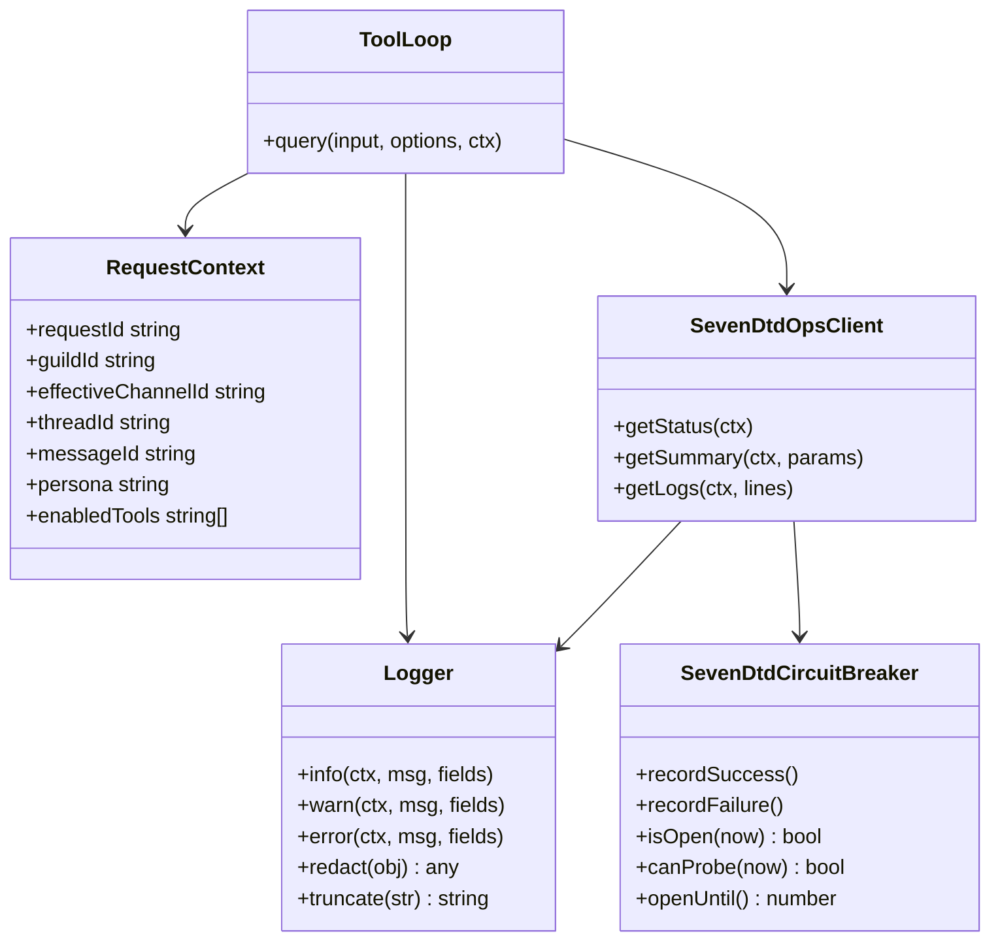
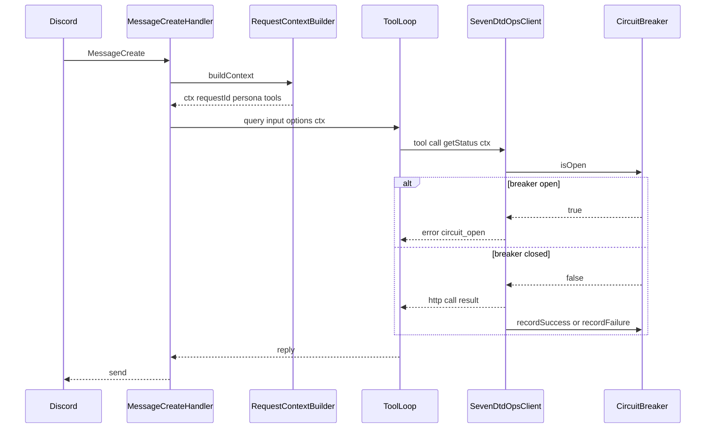

## 1. 概要と目的 Overview and Purpose

### What

Discord ボットを運用投入できる品質へ寄せるために、次の三点を追加する。

1. 本番投入前の最終検証の型を固定する
   手動スモークテスト手順と期待結果を Runbook 化し、失敗時に切り分けしやすい観測ポイントも併記する。加えて、7dtd ツール出力の成功失敗フォーマットを安定させる。

2. 観測性と事故調査の足場を作る
   受信メッセージ単位で相関 ID を生成し、Discord コンテキスト、選択 persona、tool list、ツール実行回数、所要時間、HTTP ステータスなどを構造化してログに残す。秘密情報と長文出力は確実にマスクと制限を行う。

3. 連続失敗時の抑制を入れる
   7dtd API が不調なときに失敗を増幅させないため、簡易サーキットブレーカを導入する。一定回数連続で失敗したら一定時間 7dtd ツール実行を抑止し、LM には安定したエラー JSON を返す。

### Why

* 許可外露出が無いことを確実に検証できる形にする
* トラブル時に原因を追える最小限の証跡を残す
* 下流障害時にボットが落ちない、タイムアウト連鎖しない状態にする

### How

* `Allowlist` 判定結果と tool options の決定に加え、`RequestContext` を作って `tool-loop` と 7dtd client に渡す
* ログは共通の logger wrapper に統一し、必ず requestId を含める
* サーキットブレーカは 7dtd ツール実行の直前に判定し、open の場合は HTTP を叩かずに失敗 JSON を返す
* スモークテストは Runbook として保存し、期待値に tool list と persona の観測点を含める

---

## 2. 仕様と受け入れ条件 Specification and Acceptance Criteria

### 2.1 スコープ Scope

#### 今回やること

* スモークテスト Runbook を追加し、検証項目と期待結果を固定する
* 7dtd ツール出力の成功失敗フォーマットを共通化する
* メッセージ単位の相関 ID を導入し、主要イベントを構造化ログとして記録する
* `src/index.ts` と `src/discord/message-create-handler.ts` から `RequestContext` を生成し、`queryLmStudioResponseWithTools(input, options, ctx)` と 7dtd client まで渡す
* bearer token と長文出力のマスキングと長さ制限を実装する
* 簡易サーキットブレーカを導入し、連続失敗時に 7dtd ツール実行を抑止する
* Vitest にユニットテストを追加する

#### 成果物

* Runbook ドキュメント

  * `docs/runbooks/7dtd-bot-smoke-tests.md`
  * `docs/runbooks/7dtd-bot-operations.md`
* 観測性

  * `src/observability/request-context.ts` などの新規モジュール
  * logger wrapper
* サーキットブレーカ

  * `src/seven-dtd/circuit-breaker.ts`
* テスト追加

  * allowlist 連携観測
  * 出力 JSON 形式
  * サーキットブレーカ状態遷移
  * マスキング

#### 制約

* 外部のログ基盤や APM は導入しない
  まずはローカル標準出力ログで成立させる
* 統合テストで実 API を叩かない
  HTTP はモック中心で固定する

### 2.2 非スコープ Non Scope

* Discord 権限体系との連動やロールベース制御
* 監査ログの永続化と可視化ダッシュボード
* 7dtd API の自動コード生成

### 2.3 ユースケース Use Cases

#### 正常系

1. 許可チャンネルで status を問い合わせる
   ログに requestId と tool list と 7dtd HTTP ステータスと所要時間が残る
2. 非許可チャンネルで 7dtd を問い合わせる
   7dtd ツール定義が渡らないことを Runbook で確認できる
3. 7dtd API が安定している間はサーキットブレーカは閉じたまま

#### 異常系

1. 7dtd API が 5 回連続で失敗する
   サーキットブレーカが open になり、以後一定時間は HTTP を叩かずに `circuit_open` を返す
2. token 未設定
   7dtd ツールは `seven_dtd_*` 系のエラーコードを返し、例外で落ちない
3. 7dtd API タイムアウト
   `seven_dtd_*` 系の失敗 JSON を返し、ボットは落ちない
4. 7dtd 応答が巨大
   マスクと切り詰めが効き、Discord 返信とログが破綻しない

### 2.4 受け入れ条件 Acceptance Criteria

* Given Runbook が追加されている
  When スモークテストを手順通りに実施する
  Then 7dtd ツール露出の有無と persona 適用有無を確認できる

* Given 任意のメッセージを処理する
  When ログを確認する
  Then requestId が全ログ行に含まれ、guildId と effectiveChannelId と persona と tool list が記録される

* Given `src/index.ts` から `handleMessageCreate` を経由して tool-loop を呼ぶ
  When 7dtd ツールが実行される
  Then 同一 requestId が `message-create-handler` `tool-loop` `seven-dtd-client` のログで一貫している

* Given `SEVEN_DTD_OPS_TOKEN` が未設定
  When 7dtd ツールが実行される
  Then `ok:false` と `error.code=seven_dtd_*` を含む JSON を返し、ボットは例外で落ちない

* Given 7dtd API が連続失敗する
  When failure threshold を超える
  Then サーキットブレーカが open になり、open 期間中は HTTP 呼び出しが発生しない

* Given bearer token が設定されている
  When ログを確認する
  Then token がログに出力されない

* Given 7dtd の出力が長い
  When Discord に返信する
  Then 返信文字数制限を超えず、ログも最大長制限に収まる

### 2.5 既知の制約 Known Limitations

* サーキットブレーカ状態はプロセス内メモリに保持される
  再起動するとリセットされる
* requestId は Discord メッセージ単位で生成し、スレッド全体での相関は行わない

---

## 3. 前提技術スタック Context and Tech Stack

* TypeScript, Node.js, discord.js
* fetch, AbortController
* Testing: Vitest
  タイマーは fake timers を使う

---

## 4. インターフェース契約 Interface Contracts

### 4.1 外部 I O

* Discord 入力
  `msg.id` `msg.guildId` `msg.channelId` `msg.channel.isThread()` `msg.channel.parentId`
* 設定
  `.env`
* 外部サービス
  7dtd Ops API

### 4.2 設定と環境変数

* `LOG_LEVEL` 省略時 info
* `LOG_MAX_CHARS` 省略時 2000
* `SEVEN_DTD_CB_FAILURE_THRESHOLD` 省略時 5
* `SEVEN_DTD_CB_OPEN_MS` 省略時 60000
* `SEVEN_DTD_OPS_TIMEOUT_MS` 既存方針を継続

### 4.3 ログスキーマ

ログは JSON 形式で統一し、最低限次を含める。

* `ts` `level` `requestId`
* `discord.guildId` `discord.effectiveChannelId` `discord.threadId` `discord.messageId`
* `tool.persona` `tool.enabledTools`
* ツール実行時
  `tool.call.name` `tool.call.durationMs` `http.status` `http.durationMs` `http.endpoint`
  ただし `http.endpoint` は path のみを記録し、query string は記録しない
  request/response body はログに出さない
  `Authorization` ヘッダ値と `SEVEN_DTD_OPS_TOKEN` 生文字列は必ず `[REDACTED]` へ置換する
* エラー時
  `error.code` `error.message` `error.details` ただし details は長さ制限

### 4.4 7dtd ツール出力の共通形

成功失敗どちらも同じトップレベル構造で返す。

```json
{
  "ok": true,
  "data": { },
  "meta": {
    "requestId": "....",
    "durationMs": 123
  }
}
```

失敗は次。

```json
{
  "ok": false,
  "error": {
    "code": "timeout",
    "message": "7dtd ops api timeout",
    "details": { }
  },
  "meta": {
    "requestId": "....",
    "durationMs": 10000
  }
}
```

---

## 5. アーキテクチャと設計図 Architecture and Diagrams

### 5.1 クラス図 Class Diagram



### 5.2 シーケンス図 Sequence Diagram



---

## 6. テスト戦略 Test Strategy

### 6.1 Unit

* RequestContextBuilder

  * thread の parentId 解決が正しい
  * persona と tool list が context に入る
* Logger

  * token が含まれるオブジェクトを渡しても出力に token が残らない
  * truncate が `LOG_MAX_CHARS` を守る
* SevenDtdCircuitBreaker

  * failure threshold 到達で open
  * open 期間中は isOpen が true
  * open 期間経過で half-open 扱いになり、最初の 1 リクエストのみ probe 実行
  * half-open の probe 成功で closed、失敗で open に戻る
* SevenDtdOpsClient

  * breaker open のとき HTTP を呼ばない
  * timeout で timeout エラー JSON
  * 非 200 で http_error エラー JSON

### 6.2 Contract

* 7dtd ツール出力 JSON のトップレベル形が変わらない

---

## 7. 実装タスクリスト Implementation Plan

### Phase 1 スモークテスト Runbook と出力の安定化

* [x] Test 7dtd ツール出力が成功失敗で共通形を持つ Red
  対象: `tests/seven-dtd-output-shape.test.ts`
* [x] Impl 共通レスポンスヘルパを追加 Green
  対象案: `src/tools/tool-output.ts`
* [x] Refactor 既存 7dtd ツールが共通形を使う
  対象: `src/tools/seven-dtd-ops.ts` など
* [x] Test `seven_dtd_*` エラーコード互換を維持する Red
  対象: `tests/seven-dtd-output-shape.test.ts`
* [x] Docs スモークテスト手順を追加
  `docs/runbooks/7dtd-bot-smoke-tests.md`
  観測点として requestId と persona と enabledTools を明記する

### Phase 2 相関 ID と構造化ログとマスキング

* [x] Test RequestContextBuilder が必要項目を埋める Red
  対象: `tests/request-context.test.ts`
* [x] Impl RequestContext を導入 Green
  対象案: `src/observability/request-context.ts`
* [x] Test `handleMessageCreate` から query/tool-loop へ requestId が受け渡される Red
  対象: `tests/message-create-handler.test.ts` `tests/tool-loop.test.ts`
* [x] Impl `queryLmStudioResponseWithTools(input, options, ctx)` へシグネチャ拡張 Green
  対象: `src/discord/message-create-handler.ts` `src/index.ts` `src/discord/tool-loop.ts`
* [x] Test Logger の redact と truncate Red
  対象: `tests/logger.test.ts`
* [x] Impl logger wrapper を導入 Green
  対象案: `src/observability/logger.ts`
* [x] Refactor tool-loop と 7dtd client が ctx を受け取りログする
  対象: `src/discord/tool-loop.ts` `src/seven-dtd/client.ts`
* [x] Docs 運用者向けのログ見方を追加
  `docs/runbooks/7dtd-bot-operations.md`

### Phase 3 サーキットブレーカ

* [x] Test ブレーカ状態遷移 Red
  fake timers で closed -> open -> half-open -> closed の遷移を検証
  対象: `tests/circuit-breaker.test.ts`
* [x] Impl SevenDtdCircuitBreaker Green
  対象: `src/seven-dtd/circuit-breaker.ts`
* [x] Test breaker open 中は HTTP を叩かない Red
  fetch モックで呼び出し回数を検証
  対象: `tests/seven-dtd-client-breaker.test.ts`
* [x] Impl 7dtd client に breaker 判定を追加 Green
  open の場合は `circuit_open` を返す
* [x] Docs 連続失敗時の挙動と解除条件を Runbook に追記

---

## 8. 完了の定義 Definition of Done

### 機能 DoD

* Runbook が追加され、許可外露出の確認と障害時の切り分けが可能
* requestId と主要フィールドがログに残り、秘密情報がマスクされる
* サーキットブレーカが連続失敗で open し、open 中は HTTP を呼ばない

### 品質 DoD

* 追加したテストがすべてパス
* 既存テストを壊さない
* ログに token が出ないことがテストで保証される

---

## 9. 懸念事項と未確定事項 Concerns and Questions

* ログ形式を console JSON にするか、pino 等を導入するか
  プロトタイプ優先なら console JSON で十分。将来の移行も容易
* ブレーカの指標を連続失敗にするか、一定時間窓で失敗率にするか
  まずは連続失敗が実装も運用理解も簡単
* 返信の長さ制限
  Discord 文字数上限に合わせて一律 truncation するか、ログ系はファイル添付やスレッド分割にするか
  今回は一律 truncation が最短
