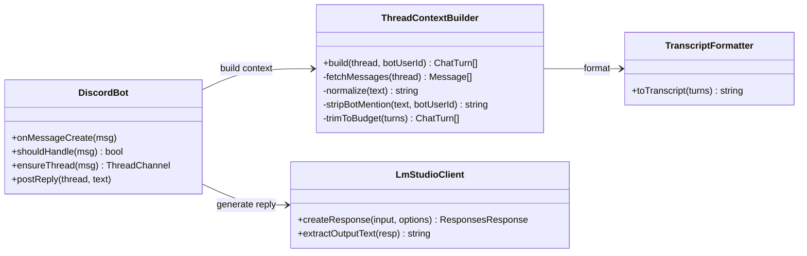
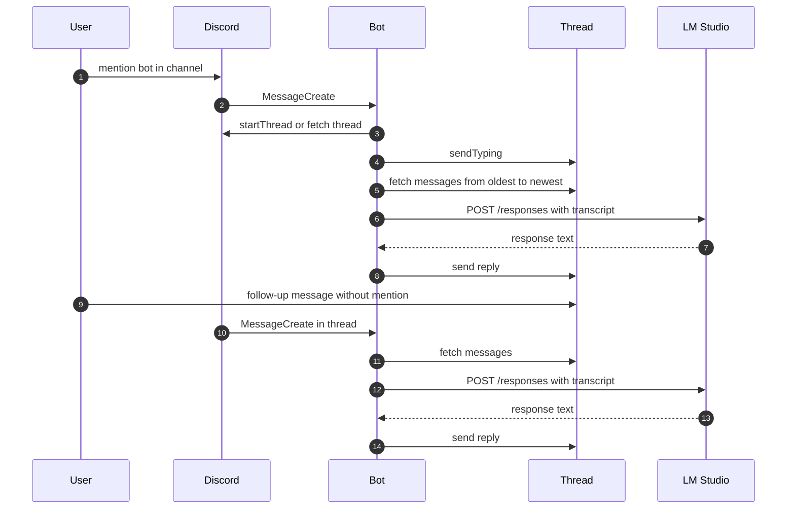

## 1. 概要と目的 Overview and Purpose

- What
  Discord でボットが作成したスレッド内の会話について、毎ターン スレッド履歴を上から取得してコンテキストを再構築し、その全文を LM Studio の Responses API に送って応答を生成し、スレッドへ投稿する

- Why
  LM Studio のリロードやモデル切り替えで `previous_response_id` が無効化されても会話継続性を維持したい
  つまり LLM 側のセッション状態に依存せず Discord 側を単一の真実の情報源にしたい

- How
  スレッドIDをキーに、スレッド履歴を Discord API から取得し、role 付きの会話トランスクリプトに整形して毎回 LLM に送信する
  長文化による上限を避けるため、文字数とメッセージ数の予算で切り詰める

---

## 2. 仕様と受け入れ条件 Specification and Acceptance Criteria

### 2.1 スコープ Scope

- 今回やること
  - 通常チャンネルでボット宛メンションを検知したら、その投稿に紐づくスレッドを作成または取得し、以後の応答はスレッドへ投稿する
  - ボットが作成したスレッド内で他ユーザーが投稿した場合、メンション無しでも処理対象とする
  - 毎ターン、スレッド履歴を上から取得し、会話コンテキストとして LM Studio Responses API に送って応答を生成する
  - スレッド履歴の再構築では、ボット自身の投稿は assistant、他ユーザーの投稿は user として整形する
  - スレッド履歴が長い場合は予算内に収まるよう切り詰める

- 成果物
  - `src/index.ts` のスレッド運用と履歴リハイドレーション対応
  - スレッド履歴整形ロジックの新規モジュール
  - 最低限のユニットテスト一式
  - 代表的な設定例と実行例の更新

- 制約
  - Discord API の取得可能範囲とレート制限に従う
  - LLM のコンテキスト長に依存するため、完全に無制限な全文送信はできない
    つまり 予算超過時は古い履歴を切り落とす

### 2.2 非スコープ Non Scope

- 今回やらないこと
  - スレッドの古い部分を要約して永続化し、長期会話を高品質に維持する仕組み
  - ツール呼び出し function_call を Discord 経由でも解決する仕組み
  - 複数ギルドや複数チャンネルにまたがる統合的な会話管理
  - 会話の永続ストレージ 例 Redis や DB

- 将来検討だが今回除外すること
  - スレッドごとの要約キャッシュ
  - 添付ファイルや埋め込みの内容取り込み
  - 返信参照や引用を使ったコンテキスト最適化

### 2.3 ユースケース Use Cases

- 正常系
  1. 通常チャンネルでユーザーがボットをメンションして質問する
     ボットがスレッドを作成し、そこで返信する
     以後、スレッド内の会話はメンション無しで継続できる
  2. スレッド内で別ユーザーが追加質問する
     ボットがスレッド履歴を再取得して文脈込みで回答する

- 重要な異常系
  1. スレッド作成権限がない
     ボットは通常返信にフォールバックするか、権限不足を通知して終了する
  2. スレッド履歴取得に失敗する 例 一時的な API エラー
     直近取得可能な範囲のみで再構築し、失敗したことをログに残した上で応答を返す
  3. スレッドが長く予算超過する
     ルールに従い古い履歴を切り落として応答する

### 2.4 受け入れ条件 Acceptance Criteria

- Given 通常チャンネルでユーザーがボットをメンションする
  When ボットがメッセージを受信する
  Then そのメッセージに紐づくスレッドを作成または取得し、スレッドへ応答を投稿する

- Given ボットが作成したスレッド内でユーザーがメンション無しで投稿する
  When ボットがメッセージを受信する
  Then スレッド履歴を取得してコンテキストを再構築し、LM Studio に送って生成した応答をスレッドへ投稿する

- Given スレッド内の会話が複数ターン続いている
  When ユーザーが追加質問する
  Then 直前のターンだけでなくスレッド履歴を含むトランスクリプトが LLM に送られる

- Given スレッド履歴が予算を超える
  When トランスクリプトを構築する
  Then 予算内に収まるまで古い履歴から切り落とし、破綻しないトランスクリプトを生成する

- Given スレッド作成ができないチャンネルまたは DM でメンションが来る
  When ボットがメッセージを受信する
  Then スレッド返信を行わず、通常返信または失敗理由の通知を行う

### 2.5 既知の制約 Known Limitations

- トランスクリプト予算超過時は古い履歴が欠落する
  つまり 会話が極端に長いと初期文脈は維持できない
- Discord 履歴取得はレート制限の影響を受ける
  高頻度のスレッドでは遅延が発生し得る
- 添付ファイルや埋め込みは現状の本文のみを対象とする

---

## 3. 前提技術スタック Context and Tech Stack

- Language Framework
  TypeScript
  Node.js
  discord.js v14 系を想定

- Libraries
  既存の fetch 実装を維持し、LM Studio の OpenAI互換 Responses API を呼ぶ

- Style Guide
  既存のフォーマットと命名規約に従う
  今回の追加は関数分割と責務分離を優先し、単一ファイル肥大化を避ける

- Runtime Deployment
  ローカル実行を前提
  `.env` に Discord トークンと LM Studio エンドポイント設定

- Testing
  リポジトリ添付物にテスト基盤が含まれていないため、最小のテストランナー導入が必要
  候補は Node 組み込み `node:test` か Vitest
  プロトタイプ優先で導入コストが低い方を採用する

---

## 4. インターフェース契約 Interface Contracts

### 4.1 公開APIまたは外部I O一覧

- 外部サービス連携
  - Discord Gateway イベント `MessageCreate`
  - Discord REST `thread.messages.fetch` と `msg.startThread`
  - LM Studio Responses API
    `POST {LM_BASE_URL}/responses`

- 設定ファイル
  - `.env`
    - `DISCORD_TOKEN` 必須
    - `LM_BASE_URL` 任意
    - `LM_MODEL` 任意
    - `LM_API_KEY` 任意
    - `DEBUG_ASSISTANT` 任意

### 4.2 データモデルとスキーマ

- トランスクリプト内部モデル
  - `ChatTurn`
    - `role: "user" | "assistant"`
    - `text: string`

- トランスクリプト構築方針
  - user には `username: message` の形式で付与し、複数ユーザー会話でも発話者を保持する
  - assistant はボット自身の投稿のみを対象とする
  - user テキストからボットメンション表現 `<@id>` `<@!id>` は除去する
  - 空文字、システムメッセージ、ボット以外の bot 投稿は除外する

- 予算
  - `MAX_THREAD_MESSAGES` 例 200
  - `MAX_TRANSCRIPT_CHARS` 例 20000
    いずれも環境変数化は将来検討とし、まずは定数でよい

### 4.3 エラーと例外 Error Handling

- エラー分類
  - Discord 権限エラー
    スレッド作成不可、スレッド投稿不可、履歴取得不可
  - Discord 一時エラー
    タイムアウト、レート制限
  - LM Studio 通信エラー
    fetch 失敗、非200、レスポンス形式不正

- リトライ方針
  - プロトタイプとしてアプリ内自前リトライはしない
    ただし Discord のレート制限はライブラリが吸収する前提
  - LM Studio 失敗時は既存のフォールバック返信を返す

- タイムアウト方針
  - LM Studio への fetch に明示タイムアウトが無い場合は導入する
    例 30秒で中断しフォールバック

- ログ方針と個人情報の扱い
  - デバッグ時のみトランスクリプト全文を出さない
    つまり 本文は長さとハッシュ程度に留める
  - エラーは種別とステータス、スレッドID、メッセージIDを記録する

### 4.4 代表的な例 Examples

- 例 スレッドでの会話継続
  - 通常チャンネル
    `@bot 今日の予定を3行でまとめて`
  - ボットはスレッド `suzume: 今日の予定を3行でまとめて` を作成しスレッドへ投稿
  - ユーザーがスレッド内で
    `それをもう少し具体的に`
    と投稿
  - ボットはスレッド履歴を取得し、トランスクリプトを送って文脈込みで回答

- 例 予算超過時
  - スレッドが長く `MAX_TRANSCRIPT_CHARS` を超える
  - 古いメッセージから削り、直近中心でトランスクリプトを構築する

---

## 5. アーキテクチャと設計図 Architecture and Diagrams

### 5.1 図の選択方針

- 外部I O と責務分割があるためクラス図を採用する
  追加でスレッド会話のシーケンス図も提示する

### 5.2 クラス図 Class Diagram

### 5.3 その他の図 Optional

---

## 6. テスト戦略 Test Strategy

### 6.1 テストの種類

- Unit
  - `ThreadContextBuilder.build` の整形とフィルタリング
    - ボットメンション除去
    - role 付与の正しさ
    - 空文字、システムメッセージ除外
    - 予算超過時の切り詰め

  - `TranscriptFormatter.toTranscript` の出力形式

- Integration
  - Discord API と LM Studio を実物で繋ぐ自動試験は今回必須にしない
    ただし手動確認手順を DoD に含める

- Contract
  - トランスクリプトの契約を壊す変更が入ったら、出力スナップショット相当のテストで検知する

### 6.2 カバレッジ対象

- 重要ロジック
  - スレッド判定 ロジック
  - 履歴整形と予算トリミング

- エラー分岐
  - スレッド作成不可
  - 履歴取得不可
  - LM Studio 通信失敗

- 境界条件
  - 文字数ちょうど上限
  - メッセージ数ちょうど上限
  - スレッド内だが ownerId がボットではない

---

## 7. 実装タスクリスト Implementation Plan

TDD Red Green Refactor を意識して分割する。チェックボックスは実装完了時に更新する。

### Phase 1 設計と準備

- [x] 要件と仕様の確定 受け入れ条件の確定
- [x] インターフェース契約の確定 トランスクリプト形式と予算定数の確定
- [x] Mermaid図の作成 更新
- [x] 新規モジュール配置方針の決定
      例 `src/context/thread-context.ts` `src/context/transcript.ts`
- [x] テスト基盤の確認
      既存に無ければ Node の `node:test` か Vitest を採用して最小構成を追加

### Phase 2 スレッド履歴リハイドレーションの実装

- [x] Test ThreadContextBuilder が履歴を時系列に並べ role と本文整形ができる Red
      対象 `src/context/thread-context.test.ts`
- [x] Impl ThreadContextBuilder を最小実装 Green
      対象 `src/context/thread-context.ts`
- [x] Refactor 正規化 関数分割 重複排除 Refactor
- [x] Test 予算超過時に古い履歴から切り落とす Red
- [x] Impl 予算トリミングを実装 Green
- [x] Refactor トリミングを単一責務に整理 Refactor

### Phase 3 Discord ハンドラをスレッド会話中心に変更

- [x] Test shouldHandle が通常チャンネルではメンション必須、ボット作成スレッドではメンション不要 Red
      対象 `src/discord/should-handle.test.ts` または同等
- [x] Impl `src/index.ts` にスレッド判定と ensureThread を組み込み Green
- [x] Refactor `index.ts` の責務を関数単位で整理し可読性を上げる Refactor
- [ ] Integration 手動確認手順を実施
      スレッド作成、スレッド内継続、権限不足時の挙動
- [x] Docs 契約例と設定例を更新

### Phase 4 LM 呼び出しをトランスクリプト入力へ切り替え

- [x] Test TranscriptFormatter が期待フォーマットを出す Red
- [x] Impl `createResponse` 呼び出しをトランスクリプト文字列に変更 Green
      つまり `previous_response_id` を使わず、毎回 `input` に全文を送る
- [x] Refactor エラー処理とタイムアウト導入 Refactor
- [ ] Integration LM Studio リロード後もスレッド継続できることを手動確認
- [x] Docs 代表例を追記

### Phase 5 統合と検証

- [x] 全体テストの実行
- [ ] エッジケースの動作確認
      長スレッド、複数ユーザー、スレッド作成不可
- [ ] ログと例外の確認
      タイムアウト、LM Studio 失敗、Discord API 失敗
- [x] ドキュメント更新 仕様 契約 図

---

## 8. 完了の定義 Definition of Done

### 8.1 機能DoD Functional DoD

- [ ] 受け入れ条件がすべて満たされていること
- [x] 既知の制約が明文化され、想定通りであること
- [ ] 代表例のフローでスレッド会話が継続し、LM Studio リロード後も破綻しないこと

### 8.2 品質DoD Quality DoD

- [x] 全てのテストがパスしていること
- [x] Linter Formatter のエラーがないこと
- [x] デバッグログが過剰に本文を出力しないこと
- [x] 主要な変更点がドキュメントに反映されていること

---

## 9. 懸念事項と未確定事項 Concerns and Questions

- テスト基盤が添付コードに含まれていない
  どのテストランナーを採用するかを決める必要がある
- Discord のスレッド権限がサーバー設定に依存する
  権限不足時のフォールバック方針を明確にする必要がある
  例 通常返信に落とすか、エラー通知のみで止めるか
- すべて上から読む方針は理想だが、長大スレッドでは現実的に送信できない
  つまり 予算超過時の切り詰めは必須で、ユーザー期待とのすり合わせが必要
- スレッド内で短時間に連投があると、応答が前後する可能性がある
  スレッド単位の直列化キューを入れるかは要判断
  ステートレスでも投稿順の安定性のために入れる価値はある
