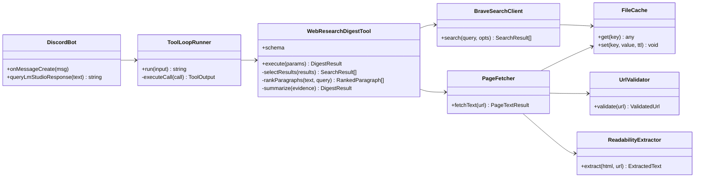

## 1. 概要と目的 Overview and Purpose

- What
  Brave Web Search API を使った Web 調査ツール `web_research_digest` を追加し、添付の Discord Bot から LM Studio Responses API の tool use として実行できるようにする。ツールは 検索 取得 抽出 要約 根拠提示 を Node 側で完結させ、LLM には圧縮済みの調査結果だけを返す。

- Why
  Web 情報を取り込めるようにしつつ、LLM への入力コンテキスト消費を抑えたい。同時に SSRF やプロンプトインジェクションなどの Web 由来リスクを下げ、結果の根拠追跡も可能にしたい。

- How
  既存コードの tool 実行パターン `current_time` と同様に、`web_research_digest` を function tool として定義し、Node が tool call を検出して実行し、`function_call_output` を follow up の Responses API 呼び出しへ渡す。ツール内部は Brave 検索とページ取得をキャッシュし、段落関連度で抽出し、短い箇条書きと引用アンカーを返す。robots.txt の確認は行わない。

---

## 2. 仕様と受け入れ条件 Specification and Acceptance Criteria

### 2.1 スコープ Scope

- 今回やること
  - Brave Web Search API クライアントの実装
  - URL 取得と本文抽出の実装
    Readability を第一候補にし、失敗時は簡易抽出へフォールバック
  - SSRF 対策とリダイレクト制御、タイムアウト、最大取得サイズ制限
  - 検索結果と本文抽出結果のファイルキャッシュ
  - `web_research_digest` tool の追加
    検索から要約と根拠アンカーまでを実行し、最小サイズの JSON を返す
  - Discord Bot 側の tool ループ実装
    `queryLmStudioResponse` が tool call を解決して最終回答を返せるようにする

- 成果物
  - `src/tools/web-research-digest.ts` tool 定義と実行
  - `src/web/brave-search.ts` Brave 検索クライアント
  - `src/web/fetch-page.ts` ページ取得と本文抽出
  - `src/cache/file-cache.ts` キャッシュ層
  - `src/security/url-validator.ts` SSRF 対策
  - `src/extract/readability.ts` 本文抽出
  - `src/basic.ts` tool ループ統合
  - ユニットテスト一式

- 制約
  - Brave API キーが必須
  - robots.txt の許可判定は行わない
    つまり 取得可否は URL バリデーション、タイムアウト、サイズ制限、コンテンツタイプ制限で担保する
  - 出力はコンテキスト節約のため短く制御する

### 2.2 非スコープ Non Scope

- 今回やらないこと
  - Web ページ全文の返却
  - 自動クロールや大量収集
  - 学習用途の長期データ保存
  - 検索ランキングや高度な埋め込み検索の最適化
  - 動的レンダリングのためのブラウザ実行
  - robots.txt の解釈と許可判定

### 2.3 ユースケース Use Cases

- 正常系
  1. ユーザーが最新情報や出典付き回答を求める
     LLM が `web_research_digest` を呼び、ツールが要約と根拠を返す
     LLM は結果を使って回答し、必要なら追加調査を呼ぶ

- 重要な異常系
  1. Brave API がエラーを返す
     ツールは `errors` を含む JSON を返し、LLM がその旨をユーザーへ説明できる
  2. URL がローカル向けや private IP で SSRF 判定される
     その URL は取得せず `errors` に記録する
  3. ページ取得がタイムアウトやサイズ超過する
     その URL は取得せず `errors` に記録する

### 2.4 受け入れ条件 Acceptance Criteria

- Given ユーザーが Web 調査が必要な質問をする
  When LLM が `web_research_digest` を function call する
  Then Node 側が Brave 検索とページ取得を行い、要約 bullets と citations を JSON で返す

- Given `web_research_digest` が返した citations が存在する
  When LLM が最終回答を生成する
  Then 回答は citations を根拠として参照できる形で出力される

- Given 同一クエリが短時間に繰り返される
  When `web_research_digest` が呼ばれる
  Then 検索とページ取得はキャッシュがヒットし、外部呼び出し回数が減る

- Given ユーザー入力に悪意ある URL が含まれる
  When ページ取得が実行される
  Then private IP localhost ローカルネットワークへのアクセスは拒否される

- Given ページ本文に命令文や誘導が含まれる
  When ツールが要約を生成する
  Then その命令文を実行せず、事実抽出の対象データとしてのみ扱う

### 2.5 既知の制約 Known Limitations

- robots.txt の禁止ルールは考慮しない
  つまり 一部サイトでは取得が望ましくないケースがあり得る
  プロトタイプ上の割り切りとして明記する
- 動的コンテンツや JS 実行が必要なページは抽出品質が下がる
- 段落スコアリングは単純手法のため、クエリが曖昧だと重要段落を落とす可能性がある

---

## 3. 前提技術スタック Context and Tech Stack

- Language Framework
  TypeScript
  Node.js 18 以上

- Libraries
  - discord.js 既存利用を維持
  - HTML 抽出
    - `jsdom`
    - `@mozilla/readability`

  - robots.txt ライブラリは採用しない

- Style Guide
  既存のコードスタイルに合わせ、関数は小さく、例外は境界で捕捉する

- Runtime Deployment
  ローカル実行
  環境変数で Brave API キーとキャッシュ設定を投入

- Testing
  既存に合わせる
  既存不明のため、プロトタイプ優先で Node の `node:test` を第一候補
  TS 周りが重い場合のみ Vitest を採用

---

## 4. インターフェース契約 Interface Contracts

### 4.1 公開APIまたは外部I O一覧

- 設定
  - `BRAVE_API_KEY` 必須
  - `BRAVE_API_BASE_URL` 任意
  - `WEB_CACHE_DIR` 任意
  - `WEB_SEARCH_TTL_SECONDS` 任意
  - `WEB_PAGE_TTL_SECONDS` 任意
  - `WEB_FETCH_TIMEOUT_MS` 任意
  - `WEB_FETCH_MAX_BYTES` 任意
  - `WEB_MAX_PAGES` 任意
  - `WEB_MAX_PARAGRAPHS` 任意

- 外部サービス
  - Brave Web Search API
  - Web サイトへの HTTP GET
  - Discord API 既存
  - LM Studio Responses API 既存

- 永続化ストレージ
  - ファイルキャッシュ
    `cache/search/<sha256>.json`
    `cache/pages/<sha256>.json`

### 4.2 データモデルとスキーマ

robots 関連のフィールドは持たない。

### 4.3 エラーと例外 Error Handling

- エラー分類
  - Brave API エラー
    非200、認証失敗、レート制限
  - Fetch エラー
    タイムアウト、サイズ超過、コンテンツタイプ不正
  - Security エラー
    不正 URL、private IP、許可されないプロトコル
  - Extract エラー
    Readability 失敗、HTML 破損

- リトライ方針
  プロトタイプでは自前リトライは実装しない

- タイムアウト方針
  Brave 検索とページ取得は明示タイムアウト必須

- ログ方針
  取得対象 URL とエラー種別を記録する。本文は記録しない。

### 4.4 代表的な例 Examples

robots に関する例は削除する。

---

## 5. アーキテクチャと設計図 Architecture and Diagrams

### 5.2 クラス図 Class Diagram

---

## 6. テスト戦略 Test Strategy

robots.txt 関連テストは削除する。代わりに以下を厚くする。

- URL バリデーションと SSRF 拒否
- リダイレクト回数上限
- タイムアウトと最大バイト数
- content-type 制限
- tool 出力スキーマ bullets と quote の制約

---

## 7. 実装タスクリスト Implementation Plan

### Phase 1 設計と準備

- [ ] 要件と仕様の確定 受け入れ条件の確定
      robots 非対応を既知の制約として明文化する
- [ ] インターフェース契約の確定 スキーマと例の追加
- [ ] Mermaid図の作成 更新
- [ ] 環境変数とデフォルト定数の確定
- [ ] テスト基盤の確認

### Phase 2 Brave 検索とキャッシュ

変更なし。

### Phase 3 ページ取得 本文抽出 セキュリティ

- [ ] Test UrlValidator が SSRF を防ぐ Red
- [ ] Impl UrlValidator 実装 Green
- [ ] Refactor IP 判定ロジック整理 Refactor
- [ ] Test PageFetcher が timeout max bytes redirect content-type を守る Red
- [ ] Impl PageFetcher 実装 Green
      robots 判定コードは入れない
- [ ] Refactor 抽出と取得を別責務へ分割 Refactor
- [ ] Test ReadabilityExtractor が HTML から本文を抽出できる Red
- [ ] Impl ReadabilityExtractor 実装 Green

### Phase 4 web_research_digest ツール本体

変更なし。

### Phase 5 Discord Bot への統合 tool ループ

変更なし。

### Phase 6 統合と検証

- [ ] 取得してはいけない URL を入れても SSRF で落ちることを確認
- [ ] 長文ページでも max bytes が効くことを確認
- [ ] robots 非対応である点を README などに明記

---

## 8. 完了の定義 Definition of Done

robots 対応は含めない。既知の制約に明記されていることを DoD に含める。

---

## 9. 懸念事項と未確定事項 Concerns and Questions

- robots.txt を見ないことで、取得が望ましくないサイトにアクセスし得る
  プロトタイプとして許容するが、将来は復帰可能な拡張点として `PageFetcher` に差し込み可能な設計にしておく
- LM Studio 側の tool call 実装差
  function_call と follow up が揺れる可能性があるため、tool schema と instructions の調整余地を残す
